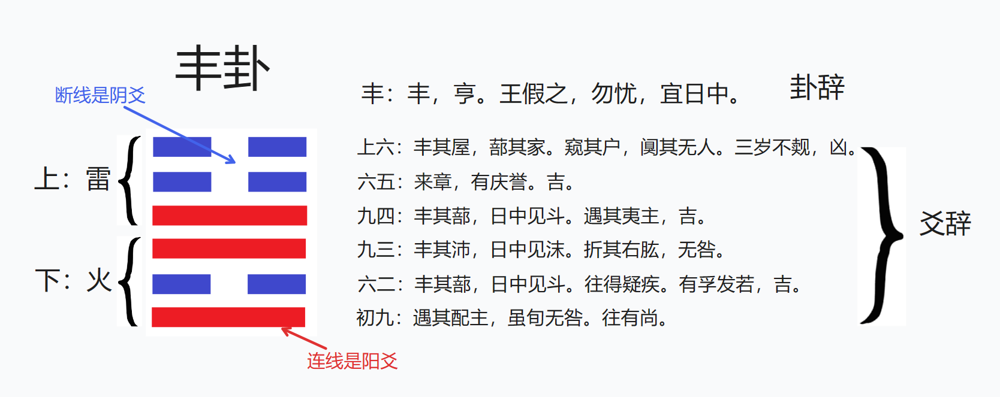

# 周易的介绍

《周易》是一本源自中国古代，用于占卜的书籍。“周”表示成书于 周朝。“易”表示主要讲变化。《周易》使用了 阴阳编码和卦爻结构 组成的符号系统[0]，以及符号所对应的预测变化与判断吉凶的卦辞以及爻辞。在占卜过程中，占卜者先得到卦爻符号，再根据书上卦爻辞，得到占卜结果。

目前对《周易》的起源还存在较大的争议，但比较流行的说法是，初稿（卦辞）为周文王所作，然后由以周公为代表的官方学者和巫师集体创作完成（爻辞）。《周礼·春官宗伯》记载：“凡卜筮，既事，则系币，以比其命。岁终，则计其占之中否。” 简言之，就是先占筮得到辞和兆，然后再和真实结果对比，最终根据应验情况来编排到卦爻辞中 [1,2]。

《周易》是中华传统文化的一个里程碑。中国古代官方学派——儒家学派，其创始人孔子，对《周易》做了很多注解。《周易》本书 和孔子等人的注解，集合成为了《易经》（详见维基百科）。此外，中华文化重要的思想流派——道家学派，以及其派生的道教，也与《周易》有一定的关联[3]。

周易有着丰富玄妙的内涵。因此后人对《周易》的解读也非常多元化。有的人注重其中卦爻关系，也就是“象数派”，如京房等；有的人注重其中的寓言和道理，被称作“义理派”，如孔子等。有的人仍然把它当作占卜工具，如高岛吞象，荣格等；也有的人利用《周易》的原理创造新的玄学系统，如邵雍等…… 《四库全书总目》中将《周易》的解读分为两宗六派[4]。

# 周易的符号系统及内容简介

《周易》的符号系统由“卦”和“爻”（yáo）组成。一共有六十四卦。每卦由纵向排列的六个爻组成，从下往上分别名为“初，二，三，四，五，上”。其中，“⚊”代表阳，称为“阳爻”，爻辞中名为“九”；“⚋”代表阴，称为“阴爻”，爻辞中名为“六”。例如：乾卦二九爻，屯卦初九爻，咸卦上六爻等等。

六十四卦又可分为上下两卦，各为八卦。八卦相传为伏羲所造，代表八种自然现象。
它们分别为：
- ☷ 坤：代表地。表示包容，奉献。
- ☶ 艮：代表山。表示静止。
- ☵ 坎：代表水。表示阻碍、危险。
- ☴ 巽：代表风。表示和顺，穿透。音xùn。
- ☳ 震：代表雷。表示激发、萌动。
- ☲ 离：代表火。表示火光，旺盛。
- ☱ 兑：代表泽。表示喜悦。
- ☰ 乾：代表天。表示强力。
参考[3]

卦名和卦象往往是上下两卦意象的组合。例如“需”卦，上卦为水，下卦为天。水在天上，就是在下雨。这不仅和“需”的象形很接近，也表示了“需”字，因为下雨所以要等待 的含义。卦辞一般简洁地说明了该卦的总体评价。而爻辞通常表示了在该卦整体意象下，具体的发展变化或情形。

下图以“雷火 丰卦” 为例，展示了周易中的符号系统及内容：

# 参考
[0]  [Site Unreachable](https://zh.wikipedia.org/wiki/%E6%98%93%E7%BB%8F)

[1]  [周礼·春官宗伯第三·大卜/诅祝原文\_翻译\_书摘天下](http://www.shuzhai.org/gushi/zhouli/8565.html)

[2]  [lionroar.net/k/336rr3/](http://www.lionroar.net/k/336rr3/)

[3]  Wilhelm, Baynes, The I Ching or Book of Changes

[4]  [易学源流之‘两派六宗’ - 知乎](https://zhuanlan.zhihu.com/p/348479147)

